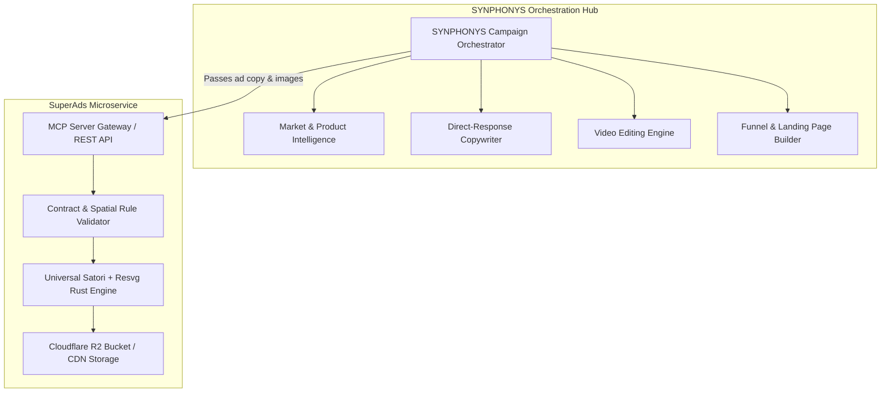

# SuperAds — External Service & Agent Integration Specification
**Architectural Contract for Headless Ad Generation in the SYNPHONYS Ecosystem**

---

## 1. System Role & Boundaries

**SuperAds is a specialized, headless, API-first & MCP-first Static Ad Generation Microservice.**

It does **not** attempt to be an all-in-one marketing suite. In the wider **SYNPHONYS** company operating system, tasks are modular and strictly decoupled:



- **What SYNPHONYS does:** Unpacks chaotic founder thoughts, identifies UMP/UMS angles, writes copy, edits video, builds funnels, and coordinates tools.
- **What SuperAds does:** Exposes template contracts, enforces image composition and text constraints, validates incoming asset payloads, and renders pixel-perfect 1080x1080 static ads in sub-300ms.

---

## 2. Integration Interfaces

External services can integrate with SuperAds via three standard protocols:

### A. Model Context Protocol (MCP) — For AI Agents
AI agents in Claude, Cursor, Antigravity CLI, or LangChain call standard MCP tools:
- Command: `node scripts/mcp-server.mjs`
- Transport: Standard I/O (JSON-RPC 2.0)
- Production Endpoint Fallback: `https://superads.orizongroup.online`

### B. REST API — For Web Apps & Microservices
- `GET /api/templates`: Discover all templates with best use cases and mandatory element lists.
- `GET /api/templates/:id`: Retrieve the full element contract, spatial coordinates, and composition rules for a specific template.
- `POST /api/validate`: Audit an ad payload before rendering (returns `isValid`, `missingMandatory`, and composition advice).
- `POST /api/assemble`: Compile and render the static ad into a PNG stream, Base64 preview, or Cloudflare R2 CDN URL.

### C. CLI — For Shell Scripts & Cron Pipelines
- `npm run cli -- list`
- `npm run cli -- render --template 1-a --vars '{"headerLine2":"..."}' --output ad.png`
- `npm run cli -- batch --input campaign-manifest.json --output-dir ./dist/`

---

## 3. Template Catalog & Element Specifications

SuperAds provides 8 production-proven direct-response templates. Every template enforces strict **spatial placement**, **image composition**, and **text length rules**:

---

### Template `1-a`: Niche Product (Default Dual Banner)
* **Best Use Case:** Physical health supplements, sexual stamina (Volcano Tea), herbal remedies, physical gadgets with a strong problem/solution angle.
* **Funnel Awareness:** **Problem-Aware** (Cold Facebook/Instagram newsfeed traffic).
* **Conversion Rationale:** Top black banner qualifies audience -> red banner asks painful question -> left photo agitates pain -> right 3D mockup shows tangible cure -> yellow pill anchors low price -> footer banners eliminate risk with Payment on Delivery.
* **Dimensions:** 1080x1080 px

#### Element Contract:
| Element Key | Type | Mandatory? | Spatial / Placement | Composition & Formatting Rules |
| :--- | :--- | :--- | :--- | :--- |
| `headerLine1` | `text` | No (defaulted) | Top black banner (`0, 0, 1080x100`) | UPPERCASE, 2–6 words, max 40 chars. White bold text 44px. Names category or audience qualification. |
| `headerLine2` | `text` | **YES** | Top red banner (`0, 100, 1080x110`) | UPPERCASE, 3–8 words, max 45 chars. White bold text 52px. The visceral scroll-stopping hook question. |
| `subjectImage` | `image` | **YES** | Left portrait (`80, 240, 520x620`, 30px rounded corners) | **CRITICAL: The person or symptom sufferer MUST BE CENTERED horizontally and vertically in the photo frame.** Off-center subjects will have their head or face cut off by `objectFit: cover`. Min resolution: 600x720px. |
| `productImage` | `image` | **YES** | Right floating (`660, 300, 330x460`) | **CRITICAL: Must be a clean 3D product mockup (box, bottle, bag) with a TRANSPARENT BACKGROUND (PNG).** Product must be centered vertically with packaging label clearly readable. |
| `priceBadgeText` | `badge` | **YES** | Right side under mockup (`650, 780, 350x70`, 15px rounded) | UPPERCASE, max 24 chars. Yellow bold text (`#FFE600`) on black pill. Always include currency (e.g. `PRIX : 5.000 FCFA`). |
| `footerLine1` | `text` | No (defaulted) | Bottom red banner (`0, 880, 1080x90`) | UPPERCASE, 3–8 words, max 48 chars. White bold text 40px. Direct action prompt emphasizing Cash on Delivery. |
| `footerLine2` | `text` | No (defaulted) | Bottom white banner (`0, 970, 1080x110`) | UPPERCASE, 4–9 words, max 52 chars. Red bold text 44px. Reassurance (e.g. `LIVRAISON RAPIDE ET DISCRÈTE`). |

---

### Template `1-b`: Niche Product (Split Copy)
* **Best Use Case:** Educational digital guides, e-books, specialized courses, boxed kits where the buyer needs a 2-sentence rationale before deciding.
* **Funnel Awareness:** **Solution-Aware**.
* **Dimensions:** 1080x1080 px

#### Element Contract:
| Element Key | Type | Mandatory? | Spatial / Placement | Composition & Formatting Rules |
| :--- | :--- | :--- | :--- | :--- |
| `topBackgroundImage` | `image` | **YES** | Top hero banner (`0, 0, 1080x500`) | **CRITICAL: Key subject or focal point must be centered vertically within the top 500px.** High-contrast landscape photo (1080x500). |
| `productImage` | `image` | **YES** | Right overlapping (`780, 380, 230x330`) | **CRITICAL: 3D book cover, tablet, or box cutout with transparent PNG background.** Bridges top photo and bottom yellow section. |
| `priceBadgeText` | `badge` | **YES** | Green capsule under mockup (`740, 740, 310x64`) | UPPERCASE, max 26 chars. White text on green capsule (`#00875A`). |
| `title` | `text` | **YES** | Left column (`50, 530, 660px wide`) | UPPERCASE, max 28 chars. Black bold 56px headline. |
| `subtitle` | `text` | **YES** | Left column (`50, 600, 660px wide`) | UPPERCASE, max 35 chars. Red bold 56px benefit statement. |
| `bodyParagraph` | `text` | **YES** | Left column (`50, 680, 660px wide`) | Normal case, 10–30 words, max 160 chars. Black 26px benefit explanation. |
| `footerText` | `text` | No (defaulted) | Bottom red banner (`0, 960, 1080x120`) | UPPERCASE, max 45 chars. White bold 48px risk reversal guarantee. |

---

### Template `2-a`: Publisher Content Card (Advertorial Newsfeed)
* **Best Use Case:** Cold traffic advertorial pre-sells, investigative journalism angles, myth-busting campaigns, newsfeed pattern interrupts.
* **Funnel Awareness:** **Unaware** (Coldest possible traffic).
* **Conversion Rationale:** Does not look like an ad; mimics high-engagement editorial newsfeed posts. Bypasses banner blindness.
* **Dimensions:** 1080x1080 px

#### Element Contract:
| Element Key | Type | Mandatory? | Spatial / Placement | Composition & Formatting Rules |
| :--- | :--- | :--- | :--- | :--- |
| `backgroundImage` | `image` | **YES** | Full-bleed (`0, 0, 1080x1080`) | **CRITICAL: The main subject, face, or focal action MUST BE IN THE UPPER 60% of the image (top 0 to 650px).** The bottom 40% is covered by a dark gradient overlay for text readability. |
| `headline` | `text` | **YES** | Centered bottom (`80, bottom 80, 920px wide`) | UPPERCASE, 6–14 words, max 75 chars. **SYNTAX RULE: Enclose the primary keyword in square brackets like `[keyword]` to automatically generate a colored highlight box.** |
| `highlightColor` | `color` | No | Inline style | Hex color for bracketed keywords (`#E50914` red, `#00875A` green, `#FFE600` yellow). |
| `logoUrl` | `image` | No | Top left/right (`50, 50, height 50px`) | Media/publication logo (PNG). Displays "NEWS" pill badge if omitted. |
| `avatarUrl` | `image` | No | Right bottom inset (`right: 80, bottom: 380, 160x160`) | **CRITICAL: Face MUST be centered in square/circle crop.** Circular author or reporter avatar with white border. |

---

### Template `3-a`: Native Social Ad (Promo Card)
* **Best Use Case:** Flash sales, limited-stock drops, impulse-buy products, and TikTok/Instagram dark-mode feed ads.
* **Funnel Awareness:** **Most-Aware** (Retargeting, warm audiences).
* **Dimensions:** 1080x1080 px

#### Element Contract:
| Element Key | Type | Mandatory? | Spatial / Placement | Composition & Formatting Rules |
| :--- | :--- | :--- | :--- | :--- |
| `backgroundImage` | `image` | **YES** | Full-bleed (`0, 0, 1080x1080`) | Dark, atmospheric or ambient background. |
| `productImage` | `image` | **YES** | Top-left circular inset (`80, 80, 240x240`) | **CRITICAL: Product MUST BE CENTERED inside the 240x240 circle.** Surrounded by bright yellow border (`#FFE600`). |
| `badgeText` | `badge` | **YES** | Top-right tilted badge (`top: 50, right: 50`) | UPPERCASE, max 20 chars. E.g. `-50% AUJOURD'HUI`. Tilted 5 degrees. |
| `headline` | `text` | **YES** | Bottom translucent card (`bottom: 80, 980px wide`) | UPPERCASE, 4–12 words, max 65 chars. White bold 42px. |

---

### Template `3-b`: Native Social (Post / Tweet Proof Card)
* **Best Use Case:** Customer testimonials, influencer endorsements, viral tweets, founder thoughts, and handling severe skepticism.
* **Funnel Awareness:** **Solution-Aware**.
* **Dimensions:** 1080x1080 px

#### Element Contract:
| Element Key | Type | Mandatory? | Spatial / Placement | Composition & Formatting Rules |
| :--- | :--- | :--- | :--- | :--- |
| `backgroundImage` | `image` | **YES** | Full-bleed (`0, 0, 1080x1080`) | Underlying atmospheric photo at 85% opacity. |
| `postAuthor` | `text` | **YES** | Post card header | Author display name (e.g. `Dr. Jean-Marc Koffi`). Max 30 chars. |
| `postHandle` | `text` | **YES** | Post card header | Twitter / X handle (e.g. `@dr_koffi_sante`). Max 25 chars. |
| `postAvatar` | `image` | **YES** | Post card avatar (`80x80` circle) | **CRITICAL: Face must be centered in square/circle crop.** |
| `postContent` | `text` | **YES** | Post card body | Authentic testimonial text. 12–40 words, max 220 chars. |
| `postStats` | `text` | No | Post card footer | Engagement proof string (e.g. `1.4K Reposts · 8.9K Likes`). |

---

### Template `4-a`: Recruitment & Opportunity Flyer
* **Best Use Case:** Recruiting tele-sales agents, closing reps, distributor recruitment, affiliate onboarding.
* **Funnel Awareness:** **All-Stages** (Job seekers & entrepreneurs).
* **Dimensions:** 1080x1080 px

#### Element Contract:
| Element Key | Type | Mandatory? | Spatial / Placement | Composition & Formatting Rules |
| :--- | :--- | :--- | :--- | :--- |
| `headerTitle` | `text` | **YES** | Top header (`0, 0, 1080x140`) | UPPERCASE, 2–5 words, max 32 chars. Red bold 56px with red underline. |
| `bodyImage` | `image` | **YES** | Centered office photo (`80, 180, 920x600`) | **CRITICAL: The workplace team or office activity MUST BE CENTERED in the 920x600 photo frame.** |
| `flagBadgeUrl` | `image` | No | Top-left of photo (`30, 30, 120x80`) | Target country flag or urgency sticker. |
| `footerSalary` | `text` | **YES** | Centered footer (`left: 80, bottom: 90, 920px`) | UPPERCASE, max 38 chars. Black bold 44px base compensation text. |
| `footerCommissions`| `text` | No | Centered footer (`left: 80, bottom: 40, 920px`) | UPPERCASE, max 38 chars. Red bold 38px uncapped bonus text. |

---

### Template `5-a`: Bold Typographic Flyer
* **Best Use Case:** Direct WhatsApp click-to-chat ad campaigns, urgent announcements, high-contrast propositions.
* **Funnel Awareness:** **Problem-Aware**.
* **Dimensions:** 1080x1080 px

#### Element Contract:
| Element Key | Type | Mandatory? | Spatial / Placement | Composition & Formatting Rules |
| :--- | :--- | :--- | :--- | :--- |
| `backgroundColor` | `color`| No (defaulted) | Canvas background | Hex color. Defaults to `#55B23B` (WhatsApp green). |
| `title` | `text` | **YES** | Centered | UPPERCASE, 3–10 words, max 55 chars. Giant white bold 72px headline. |
| `subtitle` | `text` | No | Centered | 3–12 words, max 65 chars. White 44px text. Directional action instruction. |
| `emoji` | `text` | No (defaulted) | Bottom left & right corners (`bottom: 80`) | Pointing hand emoji (`👇` at 120px) directing attention to ad CTA. |

---

### Template `custom`: Freeform Canvas (Multi-Layer JSON Stack)
* **Best Use Case:** Arbitrary multi-layer compositions constructed programmatically by external layout tools.
* **Elements:**
  - `canvasBgColor`: Background hex color.
  - `layers`: Array of objects `{ id, type: 'text'|'image'|'shape', left, top, width, height, zIndex, ... }`.

---

## 4. End-to-End Orchestration Example (SYNPHONYS Calling SuperAds)

Here is how an external orchestrator (SYNPHONYS) consumes SuperAds:

```javascript
// Step 1: Discover available templates & mandatory requirements
const templatesRes = await fetch('https://superads.orizongroup.online/api/templates');
const { templates } = await templatesRes.json();

// Step 2: Validate payload against template 1-a contract
const payload = {
  templateId: '1-a',
  variables: {
    headerLine2: 'DUREZ PLUS DE 45 MINUTES NATURELLEMENT ?',
    subjectImage: 'https://cdn.mysite.com/centered-man-stamina.jpg', // MUST BE CENTERED
    productImage: 'https://cdn.mysite.com/volcano-tea-cutout.png',   // TRANSPARENT PNG
    priceBadgeText: 'PRIX : 5.000 FCFA',
    footerLine1: 'COMMANDEZ ET PAYEZ À LA LIVRAISON',
  }
};

const validationRes = await fetch('https://superads.orizongroup.online/api/validate', {
  method: 'POST',
  headers: { 'Content-Type': 'application/json' },
  body: JSON.stringify(payload)
});
const { diagnostic } = await validationRes.json();

if (!diagnostic.isValid) {
  console.error('Missing mandatory fields:', diagnostic.missingMandatory);
  return;
}

// Step 3: Assemble & Render to Cloudflare R2
const renderRes = await fetch('https://superads.orizongroup.online/api/assemble', {
  method: 'POST',
  headers: { 'Content-Type': 'application/json', 'Accept': 'application/json' },
  body: JSON.stringify({
    templateId: '1-a',
    variables: diagnostic.resolvedVariables,
    uploadToR2: true
  })
});

const result = await renderRes.json();
console.log('Live Ad Creative URL:', result.r2Url);
```

---

## 5. Summary of Built-in Defenses & Guarantees

1. **Zero Render Crash Guarantee**: Missing optional fields are filled with battle-tested defaults; missing mandatory fields fallback to safe non-empty buffers during emergency rendering.
2. **Aspect-Ratio & Scale Bound Protection**: User images with extreme aspect ratios are bounded to prevent Satori cover-scale blowouts and Resvg panics.
3. **Emoji Grapheme Resolution**: Emojis like `👇` or `🔥` are parsed and converted to high-resolution vector SVGs automatically.
4. **Cloudflare R2 Direct CDN**: Production creatives are uploaded to edge buckets with public CDN URLs for instant inclusion in Meta and TikTok ad campaigns.
